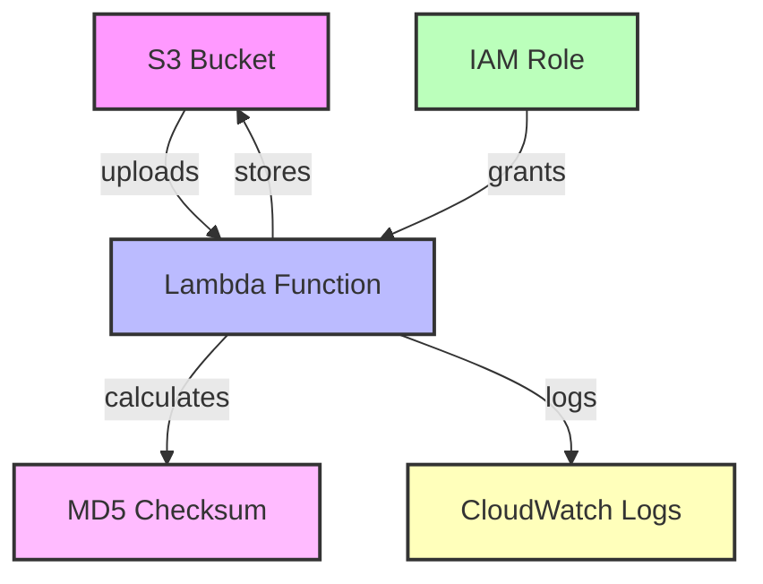

# AWS S3 Checksum Calculation Solution

## Objective

To design, propose, and implement a solution that calculates a checksum (MD5) for newly uploaded objects to an AWS S3 bucket. The solution stores the checksum file with the same prefix but with an `.md5` extension, ensuring high availability and durability. The solution is implemented using **Infrastructure as Code (IaC)** with **Terraform**.

---

## 1. Lambda Function Description and Testing

### Lambda Function Overview

The Lambda function is triggered when a new file is uploaded to the S3 bucket. It performs the following:

- Downloads the uploaded file.
- Calculates its MD5 checksum.
- Uploads the checksum as a new file with the same prefix but with an `.md5` extension.
- Deletes the temporary file used in the Lambda's execution environment.

### Key AWS Services:

- **AWS Lambda**: Executes the checksum calculation.
- **AWS S3**: Stores files and the corresponding checksum files.
- **IAM**: Manages permissions for Lambda to interact with S3.

### Testing the Lambda Function

The function is tested using **unittest** , **moto** (for AWS service mocking) and using **localstack** resources. The tests cover:
- Correct MD5 checksum calculation.
- Uploading the `.md5` file to S3 after processing.
- Ensuring the temporary file is deleted.

There is 2 lambdas examples:
1. to calculate checksum 
2. to extract checksum from metadata of s3 , without copy file locally

To run the tests:

```bash
python -m unittest discover tests
```

## Infrastructure as Code (IaC) with Terraform

### Overview

The infrastructure is automated using **Terraform**, which provisions the following AWS resources:
- **S3 Bucket**: Stores the uploaded files and their MD5 checksum files.
- **Lambda Function**: Calculates and stores the MD5 checksum.
- **IAM Role and Policies**: Provides the Lambda function with the necessary permissions to interact with S3.
- **S3 Event Notification**: Triggers the Lambda function when new objects are uploaded to the S3 bucket.

### Terraform Components

#### 1. Lambda Configuration

Defines the **Lambda function** with:
- The handler and runtime (Python 3.8).
- The environment variables (S3 bucket name).
- The path to the code zip file deployed via Terraform.

#### 2. S3 Bucket and Notification

Creates the **S3 bucket** and configures the event notification to trigger the Lambda function on any `s3:ObjectCreated` event.

#### 3. IAM Role and Policies

Sets up an **IAM role** and policies to grant the Lambda function the following permissions:
- **Read**: To download files from the S3 bucket.
- **Write**: To upload the calculated MD5 checksum back to the S3 bucket.

---

### Deployment

To deploy the infrastructure using Terraform:

1. Initialize Terraform:
    ```bash
    terraform init
    ```

2. Apply the configuration:
    ```bash
    terraform apply
    ```

This will create the necessary resources and configure the S3-to-Lambda trigger.

### Triggering Lambda for S3 Events

The S3 event notification to trigger the Lambda function can be configured through **Terraform** by setting up a notification for `s3:ObjectCreated` events. Alternatively, you can create the Lambda trigger manually in the AWS Console or through the AWS CLI by following these steps:

1. **AWS Console**:
   - Go to the **S3 bucket** in the AWS Management Console.
   - Navigate to the **Properties** tab.
   - Scroll down to the **Event notifications** section and add a new notification.
   - Select the event type (e.g., `All object create events`) and choose the **Lambda function** to trigger.

2. **AWS CLI**:
   - Use the `aws s3api` command to configure the notification:
     ```bash
     aws s3api put-bucket-notification-configuration \
        --bucket <bucket-name> \
        --notification-configuration '{
          "LambdaFunctionConfigurations": [
            {
              "LambdaFunctionArn": "<lambda-function-arn>",
              "Events": ["s3:ObjectCreated:*"]
            }
          ]
        }'
     ```

Both methods will set up the S3-to-Lambda trigger apart form possibility to config it in terraform, ensuring the Lambda function runs each time a new file is uploaded to the bucket.


### Updating Lambda Function Code

To update the code of an already deployed Lambda function, you can use the AWS CLI or Terraform. Below are two approaches:

1. **Using AWS CLI**:
   You can update the Lambda function code by providing the new deployment package (zip file) with the following command:

   ```bash
   aws lambda update-function-code \
       --function-name <lambda-function-name> \
       --zip-file fileb://<path-to-zip-file> 
   ```

### AWS Services Used

1. **AWS Lambda**: 
   - Runs the serverless function to process and calculate the MD5 checksum for newly uploaded files.

2. **Amazon S3**:
   - Stores the uploaded files and the corresponding checksum files (.md5). It also triggers the Lambda function using event notifications.

3. **IAM (Identity and Access Management)**:
   - Manages roles and permissions required for Lambda to interact with S3. Specifically, IAM roles grant `s3:GetObject`, `s3:PutObject`, and `s3:ListBucket` permissions to the Lambda function.

4. **Amazon CloudWatch Logs**:
   - Collects and monitors logs from the Lambda function for debugging and monitoring purposes.

5. **Terraform**:
   - Used to provision and manage the infrastructure, including S3 buckets, Lambda functions, IAM roles, and policies.

6. **LocalStack** (optional for local testing):
   - A fully functional local AWS cloud stack used for running and testing the entire setup locally before deployment to AWS.

7. **AWS CLI** (optional):
   - Can be used to manage and update Lambda functions, configure triggers, and more via the command line interface.

### Architecture Diagram


## Test Flow

###  Testing

For testing, I used Python's `unittest` framework along with **Moto**, which provides a mock version of AWS services like S3. This allowed us to run isolated tests without needing an actual AWS environment. The unit tests ensure:

1. **Correct MD5 Checksum Calculation**: 
   - Verifies the MD5 checksum is accurately calculated based on the file content.
   
2. **File Upload and Checksum Generation**:
   - Ensures that the `.md5` file is correctly uploaded to the S3 bucket after the checksum calculation.
   
3. **Temporary File Cleanup**:
   - Confirms that any temporary files created during the Lambda function's execution are deleted afterward.

These unit tests mock S3 interactions, simulating uploads and downloads, and validate that the Lambda behaves as expected under controlled conditions.

To run unit tests:
```bash
python -m unittest discover tests
