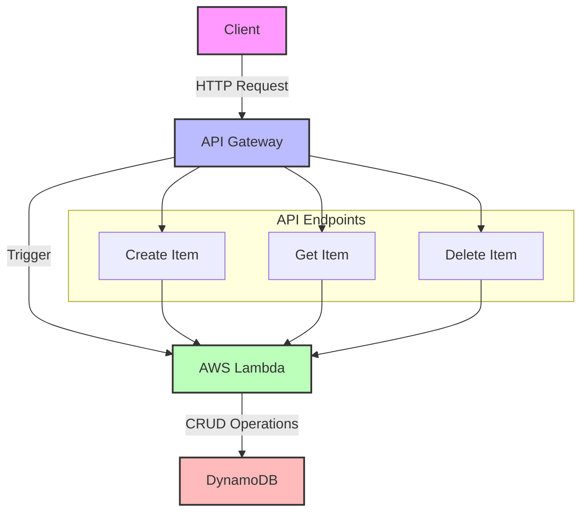
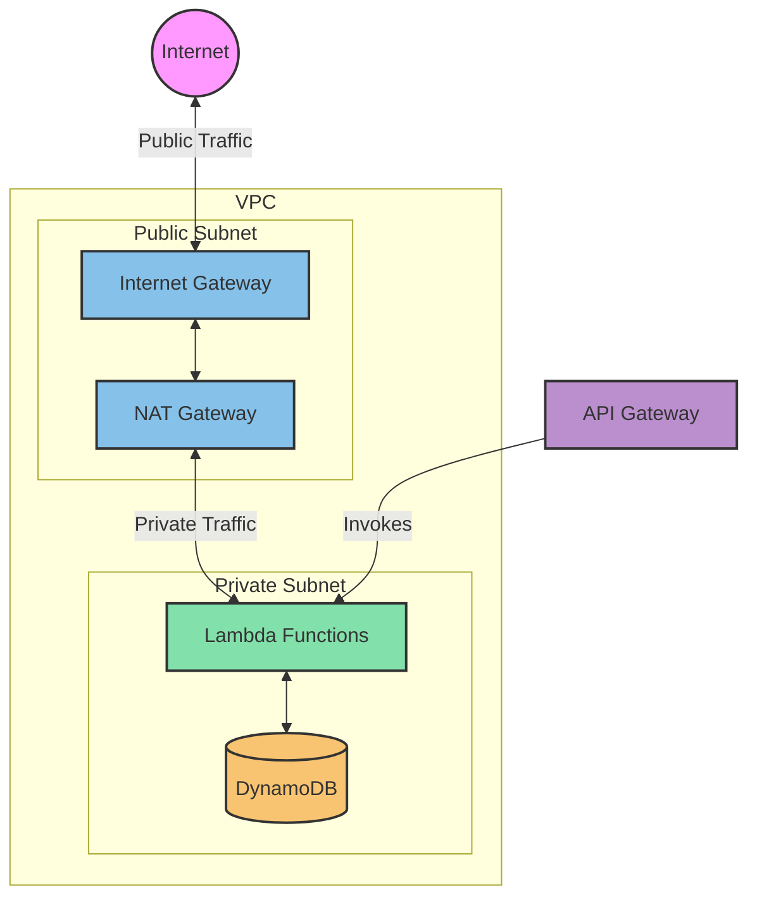
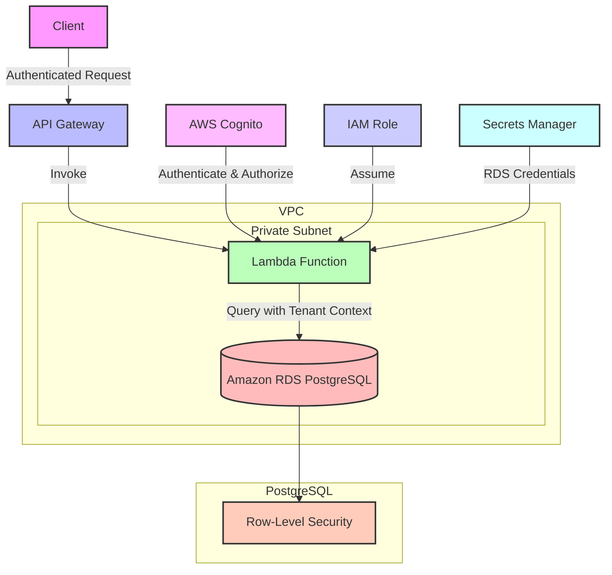
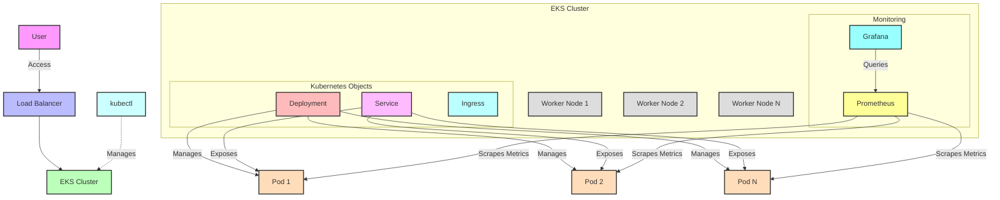

# Hello World Application with Monitoring and Logging

This repository contains a Helm chart for deploying a "Hello World" application on a Kubernetes cluster, along with integrated monitoring and logging features using AWS CloudWatch and Grafana.

## Table of Contents

- [Prerequisites](#prerequisites)
- [Installation](#installation)
- [Configuration](#configuration)
- [Deploying the Helm Chart](#deploying-the-helm-chart)
- [Monitoring and Logging](#monitoring-and-logging)
- [Accessing Grafana Dashboard](#accessing-grafana-dashboard)
- [Uninstalling](#uninstalling)

## Prerequisites

Before you begin, ensure you have the following:

- Ready AWS account
- Helm installed on  local machine
- AWS CLI configured with appropriate permissions
- Access to AWS CloudWatch and Grafana
- Terraform 

## Installation

### 1. Clone the Repository

Clone this repository to  local machine:

```code
  git clone https://github.com/taimax13/platform-tool/tree/t/assignement
  cd deployment
```
### 2. Add the NGINX Ingress Controller (if needed)
 NGINX Ingress Controller, to install if needed:
```code
helm repo add ingress-nginx https://kubernetes.github.io/ingress-nginx
helm repo update

helm install ingress-nginx ingress-nginx/ingress-nginx \
  --set controller.publishService.enabled=true \
  --set controller.service.type=LoadBalancer
```
## Configuration
values.yaml
The values.yaml file contains default values for the Helm chart. Can be customize these settings to match  environment:


```yaml

replicas: 3

image:
  repository: nginxdemos/hello
  tag: latest

service:
  type: ClusterIP
  port: 3000
  targetPort: 8080

ingress:
  enabled: true
  hostname: domain.com
  tlsSecretName: my-tls-secret

cloudwatch:
  enabled: true
  logGroupName: "/aws/api-gateway/example"
  retentionInDays: 14

grafana:
  enabled: true
  dashboardName: "lambda-monitoring-dashboard"
  lambdaFunctionName: "_lambda_function_name"
```
Environment-Specific Settings
Can be override by any value in values.yaml during deployment by using the --set flag or providing a custom values file.

Deploying the Helm Chart
To deploy the Helm chart, run the following command:

```bash

helm install hello-world ./hello-world
```
This command will deploy the application, configure CloudWatch logging, and set up the Grafana dashboard if enabled.

### Monitoring and Logging
CloudWatch Logging
CloudWatch logging is enabled for API Gateway by default. Logs are directed to the specified log group in the values.yaml file.

Grafana Dashboard
If enabled, the Helm chart will create a ConfigMap that contains a pre-configured Grafana dashboard to monitor Lambda function metrics such as:

Invocation Count
Error Count
Average Duration
Accessing Grafana Dashboard
If you have Grafana installed, Can be import the dashboard from the ConfigMap created by this Helm chart:

Port-forward the Grafana service to  local machine:

bash
```
kubectl port-forward service/grafana 3000:80
```
Open  browser and navigate to http://localhost:3000.

Log in with  Grafana credentials.

Import the dashboard by using the JSON provided in the ConfigMap.

## Architecture Diagram

### Lambdas
#  Project Title

## Architecture Diagram

### API-Getaway , Lambda, DynamoDB



### Networking
I've created a diagram that illustrates the networking configuration for  serverless web application. Here's an explanation of the components and their relationships:
VPC (Virtual Private Cloud):

Contains both public and private subnets
Provides network isolation for  resources

Public Subnet:
Contains the Internet Gateway and NAT Gateway
Allows resources to have direct internet access


Private Subnet:
Contains the Lambda functions
Provides additional security by not exposing resources directly to the internet

Internet Gateway (IG):
Allows communication between the VPC and the internet
Enables inbound and outbound internet access for the public subnet

NAT Gateway:
Located in the public subnet
Allows resources in the private subnet to access the internet while remaining private

Lambda Functions:
Deployed in the private subnet
Can access the internet through the NAT Gateway
Can also access other AWS services like DynamoDB

DynamoDB:
Shown within the VPC for illustration, but it's actually a fully managed AWS service
Lambda functions can access DynamoDB through VPC endpoints or over the internet

API Gateway:
Not part of the VPC but shown to illustrate how it invokes the Lambda functions

# VOCAL POINT: 
Lambda Function VPC Association:

By default, Lambda functions run in an AWS-managed VPC with internet access.
When you associate a Lambda function with  VPC, it loses direct internet access for added security.
The function now uses the VPC's networking, including its route tables and subnets.


Placement in Private Subnet:
Placing the Lambda function in a private subnet of  VPC.
Private subnets don't have a route to the internet gateway, preventing direct internet access.

NAT Gateway in Public Subnet:
A NAT (Network Address Translation) Gateway is deployed in a public subnet of  VPC.
The public subnet has a route to the internet gateway, allowing internet access.


Route Table Configuration:

The private subnet's route table is configured with a route that sends internet-bound traffic (0.0.0.0/0) to the NAT Gateway.


Outbound Internet Access Process:

When the Lambda function needs to make an internet request:
a. It sends the request to the NAT Gateway (as per the route table).
b. The NAT Gateway translates the private IP of the Lambda function to its own public IP.
c. The request is then sent out to the internet through the Internet Gateway.
d. When the response comes back, the NAT Gateway translates it back and forwards it to the Lambda function.

Security Group Configuration:
The Lambda function's security group should allow outbound traffic.
The NAT Gateway doesn't require specific security group rules for outbound traffic.


This setup achieves several things:

It allows Lambda functions to access internet resources (e.g., external APIs, package repositories).
It keeps the Lambda functions secure in a private subnet, not directly exposed to the internet.
It centralizes outbound internet access through the NAT Gateway, making it easier to monitor and control.

It's worth noting that this configuration adds some complexity and potential cost (NAT Gateway charges), so it's typically used when you need both VPC access for  Lambda functions and outbound internet access. If you don't need VPC resources, Lambda functions can be left outside the VPC for simpler internet access.

### The architecture of the deployment is shown below:



### Multy-tenancy

Client Authentication and Authorization:

The client authenticates using AWS Cognito, which provides user management and authentication services.
Cognito issues JWT tokens that include claims about the user, including their tenant ID.

API Gateway and Lambda:
The authenticated client sends requests to API Gateway.
API Gateway invokes a Lambda function, passing along the authentication token.

Lambda Function:
The Lambda function is placed in a private subnet within a VPC for security.
It assumes an IAM role that grants it necessary permissions.
The function verifies the Cognito token and extracts the tenant ID.
It retrieves RDS credentials from AWS Secrets Manager.

Amazon RDS PostgreSQL:
The RDS instance is also placed in a private subnet within the VPC.
It's configured with row-level security (RLS) policies.

Secure Access to RDS:
The Lambda function connects to RDS using credentials from Secrets Manager.
Network access is controlled via security groups within the VPC.

Row-Level Security in PostgreSQL:
RLS policies are set up in PostgreSQL to filter rows based on the tenant ID.
When the Lambda function connects to the database, it sets the current tenant context (e.g., SET app.current_tenant = 'tenant_id';).
RLS policies use this context to filter query results, ensuring each tenant only sees their own data.


Query Execution:
The Lambda function constructs and executes queries against RDS.
PostgreSQL's RLS automatically applies tenant-specific filters to all queries.


Data Isolation:
Even if a query doesn't explicitly filter by tenant, the RLS ensures that only data belonging to the current tenant is returned.



### Architecture   EKS

# Setting Up an EKS Cluster: (there is a terraform module as well , weapon of choice )

The EKS (Elastic Kubernetes Service) cluster is created using AWS services.
It consists of multiple worker nodes (EC2 instances) that run  containerized applications.
kubectl is configured to connect to this EKS cluster, allowing you to manage Kubernetes objects.


# Deploying a Sample Application:

A Deployment object is used to manage the application pods. This ensures a specified number of pod replicas are running at all times.
Pods (labeled Pod 1, Pod 2, Pod N in the diagram) run  "Hello World" application containers.
A Service object exposes these pods, making them accessible within the cluster or externally.
An Ingress object (not shown in detail) can be used to manage external access to the services.


Implementing Monitoring:

Prometheus is deployed within the EKS cluster to collect metrics from  application and cluster.
Grafana is also deployed in the cluster and configured to use Prometheus as a data source for visualizing the collected metrics.


# Detailed Steps:

Setting Up EKS and kubectl:
### Create EKS cluster
```eksctl create cluster --name my-cluster --region us-west-2```

# Configure kubectl
```aws eks get-token --cluster-name my-cluster | kubectl apply -f -```

Deploying the Sample Application:
```yaml
apiVersion: apps/v1
kind: Deployment
metadata:
  name: hello-world
spec:
  replicas: 3
  selector:
    matchLabels:
      app: hello-world
  template:
    metadata:
      labels:
        app: hello-world
    spec:
      containers:
      - name: hello-world
        image: nginx:latest
        ports:
        - containerPort: 80
---
apiVersion: v1
kind: Service
metadata:
  name: hello-world-service
spec:
  selector:
    app: hello-world
  ports:
    - protocol: TCP
      port: 80
      targetPort: 80
  type: LoadBalancer
```

# Apply the configuration:
```kubectl apply -f hello-world-deployment.yaml```

# Implementing Monitoring:

Install Prometheus and Grafana using Helm:
Add Helm repos
```bash 
helm repo add prometheus-community https://prometheus-community.github.io/helm-charts
helm repo add grafana https://grafana.github.io/helm-charts
helm repo update

# Install Prometheus
helm install prometheus prometheus-community/prometheus

# Install Grafana
helm install grafana grafana/grafana
```
Configure Grafana to use Prometheus as a data source:

Get Grafana admin password:
```kubectl get secret grafana -o jsonpath="{.data.admin-password}" | base64 --decode```

Port-forward Grafana service:
``````kubectl port-forward service/grafana 3000:80 ``````

Access Grafana UI at http://localhost:3000, add Prometheus as a data source, and create dashboards.




Thank you!


