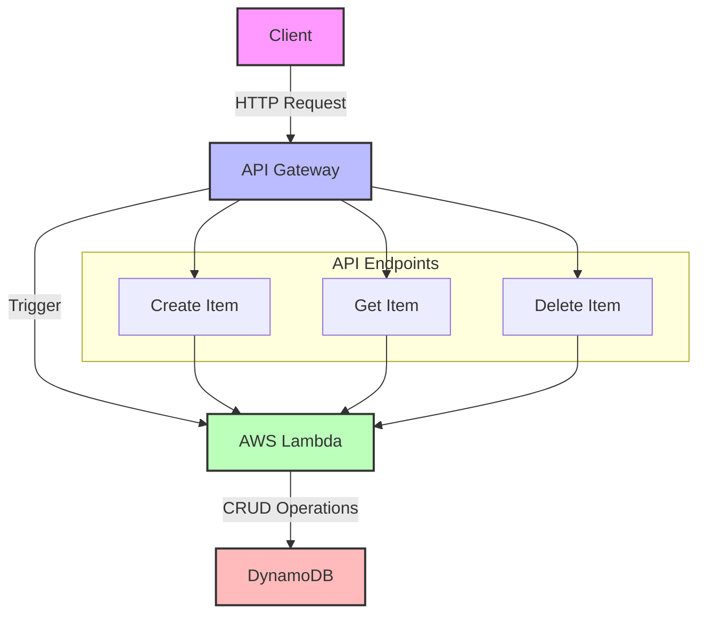
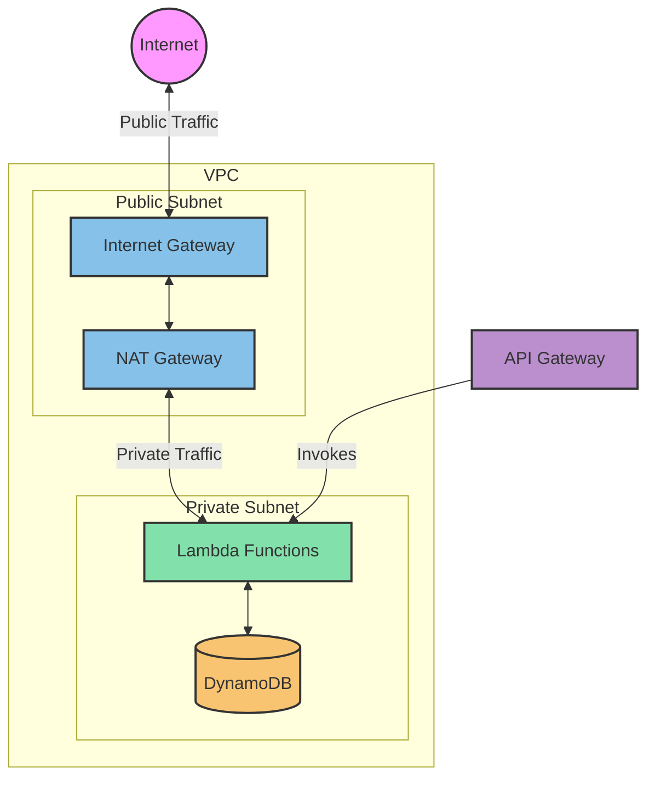

# Hello World Application with Monitoring and Logging

This repository contains a Helm chart for deploying a "Hello World" application on a Kubernetes cluster, along with integrated monitoring and logging features using AWS CloudWatch and Grafana.

## Table of Contents

- [Prerequisites](#prerequisites)
- [Installation](#installation)
- [Configuration](#configuration)
- [Deploying the Helm Chart](#deploying-the-helm-chart)
- [Monitoring and Logging](#monitoring-and-logging)
- [Accessing Grafana Dashboard](#accessing-grafana-dashboard)
- [Uninstalling](#uninstalling)

## Prerequisites

Before you begin, ensure you have the following:

- Ready AWS account
- Helm installed on your local machine
- AWS CLI configured with appropriate permissions
- Access to AWS CloudWatch and Grafana
- Terraform 

## Installation

### 1. Clone the Repository

Clone this repository to your local machine:

```code
  git clone https://github.com/taimax13/platform-tool/tree/t/assignement
  cd deployment
```
### 2. Add the NGINX Ingress Controller (if needed)
 NGINX Ingress Controller, to install if needed:
```code
helm repo add ingress-nginx https://kubernetes.github.io/ingress-nginx
helm repo update

helm install ingress-nginx ingress-nginx/ingress-nginx \
  --set controller.publishService.enabled=true \
  --set controller.service.type=LoadBalancer
```
## Configuration
values.yaml
The values.yaml file contains default values for the Helm chart. Can be customize these settings to match your environment:


```yaml

replicas: 3

image:
  repository: nginxdemos/hello
  tag: latest

service:
  type: ClusterIP
  port: 3000
  targetPort: 8080

ingress:
  enabled: true
  hostname: domain.com
  tlsSecretName: my-tls-secret

cloudwatch:
  enabled: true
  logGroupName: "/aws/api-gateway/example"
  retentionInDays: 14

grafana:
  enabled: true
  dashboardName: "lambda-monitoring-dashboard"
  lambdaFunctionName: "your_lambda_function_name"
```
Environment-Specific Settings
Can be override by any value in values.yaml during deployment by using the --set flag or providing a custom values file.

Deploying the Helm Chart
To deploy the Helm chart, run the following command:

```bash

helm install hello-world ./hello-world
```
This command will deploy the application, configure CloudWatch logging, and set up the Grafana dashboard if enabled.

### Monitoring and Logging
CloudWatch Logging
CloudWatch logging is enabled for API Gateway by default. Logs are directed to the specified log group in the values.yaml file.

Grafana Dashboard
If enabled, the Helm chart will create a ConfigMap that contains a pre-configured Grafana dashboard to monitor Lambda function metrics such as:

Invocation Count
Error Count
Average Duration
Accessing Grafana Dashboard
If you have Grafana installed, Can be import the dashboard from the ConfigMap created by this Helm chart:

Port-forward the Grafana service to your local machine:

bash
```
kubectl port-forward service/grafana 3000:80
```
Open your browser and navigate to http://localhost:3000.

Log in with your Grafana credentials.

Import the dashboard by using the JSON provided in the ConfigMap.

## Architecture Diagram

### Lambdas
# Your Project Title

## Architecture Diagram

### API-Getaway , Lambda, DynamoDB



### Networking
I've created a diagram that illustrates the networking configuration for your serverless web application. Here's an explanation of the components and their relationships:
VPC (Virtual Private Cloud):

Contains both public and private subnets
Provides network isolation for your resources

Public Subnet:
Contains the Internet Gateway and NAT Gateway
Allows resources to have direct internet access


Private Subnet:
Contains the Lambda functions
Provides additional security by not exposing resources directly to the internet

Internet Gateway (IG):
Allows communication between the VPC and the internet
Enables inbound and outbound internet access for the public subnet

NAT Gateway:
Located in the public subnet
Allows resources in the private subnet to access the internet while remaining private

Lambda Functions:
Deployed in the private subnet
Can access the internet through the NAT Gateway
Can also access other AWS services like DynamoDB

DynamoDB:
Shown within the VPC for illustration, but it's actually a fully managed AWS service
Lambda functions can access DynamoDB through VPC endpoints or over the internet

API Gateway:
Not part of the VPC but shown to illustrate how it invokes the Lambda functions
The architecture of the deployment is shown below:




Thank you!


